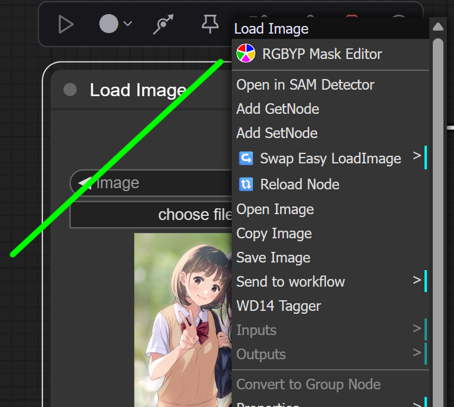
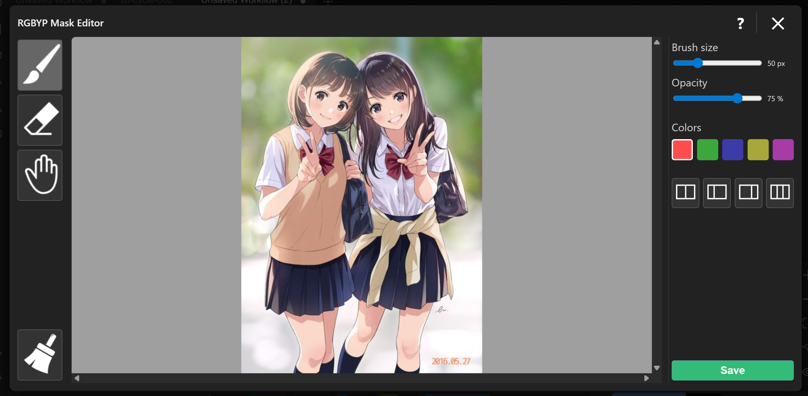
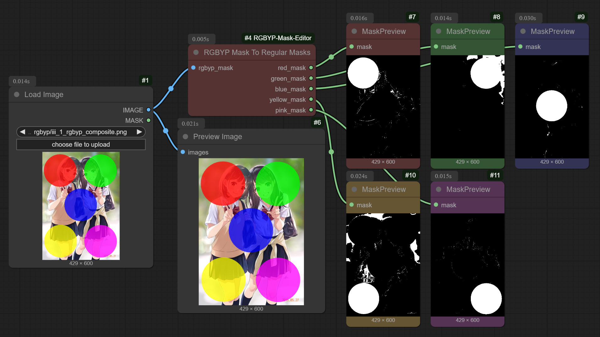
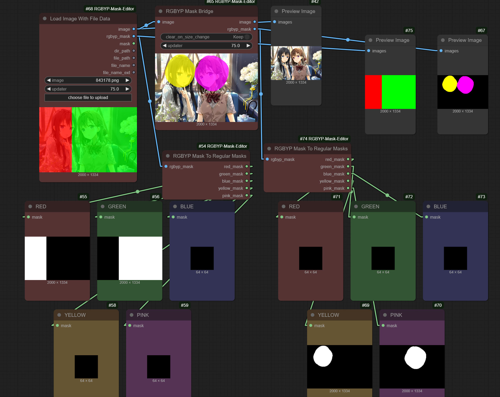
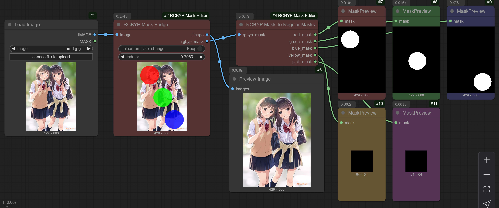

## Other My Nodes

Utilities for working with Lists, Regions, Toggling groups, Caching conditions: [ComfyUI Utils Extra](https://github.com/akawana/ComfyUI-Utils-extra)

Folding of promts in to tree with extra features. Extra shortcuts for editing prompts. Reginal prompting text separation: [ComfyUI Folded Prompts](https://github.com/akawana/ComfyUI-Folded-Prompts)

RGBYP 5-color mask editor: [ComfyUI RGBYP Mask Editor](https://github.com/akawana/ComfyUI-RGBYP-Mask-Editor)

---

## Version changes

**V 2.02**

The **file_path** output has been fixed. It now returns the path including the subfolder.
Attention: This works only for the Comfy sandbox, meaning only for the input folder. If you have files with the same name in different subfolders, you may get an incorrect path, because the only way to determine the subfolder inside input is by iterating through subfolders and searching for the file by name.

**V 2.01**

**RGBYPMaskBridge** - now has Open Mask button. You can load mask image if you create it with some other editor. Or saved on prev session with RGBYPSaveMask

**V 2.00**

**New node: RGBYPSaveMask** - Simple mask image saver which can take file_path and file_name from RGBYPLoadImage and save mask in the same folder as original image. Just useful. You can save mask with any other node. It is just an image but remember to save with alpha.

**RGBYPLoadImage** - now has Open Mask button. You can load mask image if you create it with some other editor.

+ All nodes work faster because I don't use /input/rgbyp/ folder anymore. I have changed the logic little bit.

---

# ComfyUI-RGBYP-Mask-Editor
RGB + Yellow + Pink 5-color mask editor for ComfyUI. Also includes a set of nodes for working with 5-color masks that assist with regional prompting.

## Overview
**RGBYP Mask Editor** is a custom JavaScript node that adds a full-featured color mask editor with 5 channels (RGB + Yellow + Pink).

The node saves its working files inside /ComfyUI/temp/, which allows masks to persist even after refreshing the browser page.  

> [!IMPORTANT]
> ⚠️ All files inside `/temp/` are automatically cleared when you restart ComfyUI.


The editor works on any image node (Load Image, Preview, etc.), but the package also includes special nodes that directly output RGBYP masks as separate images:

- **RGBYPLoadImage**
- **RGBYPMaskBridge**

---

## RGBYP Mask Editor
The editor opens from the **Right-Click menu** on nodes containing images.  
The menu entry appears near the top.



### Keyboard Shortcuts

<details>

- **1, 2, 3, 4, 5** — switch color. Also works with SHIFT+number
- **SHIFT + A / D** — brush size  
- **SHIFT + W / S** — mask opacity  
- **SHIFT + Z / X** — zoom  
- **SHIFT + C** — zoom to fit 
- **SHIFT + N** — clear mask  
- **SHIFT + V** — auto masking
- **SHIFT+SPACE (hold)** — pan the image. Also without SHIFT.
- **ENTER** — save mask & close  
- **ESC** — cancel & close

</details>

### Mouse Controls
- **Left click** — brush  
- **Right click** — eraser  
- **Middle click** — pan  
- **Mouse wheel** — zoom

### Opacity Note

> [!IMPORTANT]
> Changing opacity only affects the **preview**, including previews in nodes. It **does not** affect the final mask file. Default opacity is **75%**.

### Auto-Mask Tools (4 buttons)
Fill the mask horizontally:
- Split in half  
- Split 1:2  
- Split 2:1  
- Split into thirds  



---

## RGBYPLoadImage
A standard image-loading node that also outputs the RGBYP mask (or a 64×64 black placeholder if no mask was drawn).

Additional outputs:
- **file_path** — full path excluding filename  
- **file_name** — filename without extension  

Starting from version 2 you can load a mask which you create in some editor. The node now has Load Mask button. Don't forget you have to open the main image first.

The **file_path** now returns the path including the subfolder.
Attention: This works only for the Comfy sandbox, meaning only for the input folder. If you have files with the same name in different subfolders, you may get an incorrect path, because the only way to determine the subfolder inside input is by iterating through subfolders and searching for the file by name.

---

## RGBYPMaskBridge
Passes the input image through and allows drawing an RGBYP mask directly on it.  
Outputs both the image and the mask.

This node includes a parameter: **`clear_on_size_change`**

- **`false`** – the previous mask is always preserved and will be applied to any new input image, even if the new image has a different resolution.  
  This is the recommended mode. You can manually clear the mask in the editor when needed.

- **`true`** – the mask will be cleared (destroyed) whenever the input image size changes.

Starting from version 2 you can load a mask which you create in some editor. The node now has Load Mask button. Don't forget you have to open the main image first.

---

#### Important: `updater` widget

> [!WARNING]
> ⚠️ **Do not touch the `updater` widget.**

- It is used **only for internal editor logic**.  
- Do not change its value.  
- Do not connect anything to it.  
- Just ignore it in your graphs.

---

## RGBYPSaveMask
It is a simple Image Saver which takes file_path and file_name. Useful and easy with RGBYPLoadImage which provides file data. FYI: You can use any image saving node to save mask.

---

## RGBYPMaskToRegularMasks

Converts a single RGBYP mask image into **five separate grayscale masks**.  
A minimalistic utility for quick splitting.

---

## RGBYPMaskStrength + RGBYPMaskStrengthOut

Two nodes that work together as a pair.
The first node allows you to set the mask strength for each of the five colors, and the second node simply expands these settings wherever you need them.

---

## RGBYPMaskCompositeWithStrength

Together with the parameters from **RGBYPMaskStrength**, this node generates a single grayscale mask where each of the five colors is represented as a gray shade corresponding to the strength you assigned.

This node is useful for **Differential Diffusion** and many other features in ComfyUI that require masks.
With it, you can now easily create masks with different grayscale values.

---

## F.A.Q.

### Can I draw masks on regular Load Image and other nodes?
Yes, but keep in mind:

1. They output the **image with the mask baked in**, not the mask itself.  
2. Your mask edits will be lost if you refresh the browser.  
   (My nodes preserve masks because they store temp files.)

### How do I keep my mask after a full ComfyUI restart?
The RGBYP mask is just an image.  
Save the generated mask manually to your output folder and load it again in the next session.

---
If you use the standard ComfyUI nodes, you will get a baked image with the mask already applied. This means that when splitting by colors, you may end up with dirty or contaminated areas on the masks.


If you use my RGBYP Load Image node, you will have a separate output for the RGBYP mask, and the color separation will be clean.


RGBYP Mask Bridge is designed for more complex workflows. You can feed any image into it, edit the mask, and the rgbyp_mask output will give you a clean mask.


## Installation

You can install this extension in two ways:

### 1. Through ComfyUI Manager (recommended)

Open **ComfyUI Manager ? Install**,  
then simply search for **RGBYP** in the search bar.  
Select the extension and click **Install**.

### 2. Manual installation

```bash
cd ComfyUI/custom_nodes
git clone https://github.com/akawana/ComfyUI-RGBYP-Mask-Editor.git


